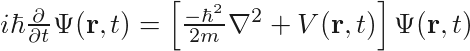

 # Markdown Math

A simple utility to convert Markdown flavored with LaTeX $$ into image equations.
Note that this overwrites the original file.
Only equations on their own line will work for now.

As an example, consider the following line in your `README.md` file:

``` latex
 $i\hbar\frac{\partial}{\partial t} \Psi(\mathbf{r},t) = \left [ \frac{-\hbar^2}{2m}\nabla^2 + V(\mathbf{r},t)\right ] \Psi(\mathbf{r},t)$
```

Running the command

``` bash
python mdmath.py README.md
```

would be rendered like this:

<p align="center" class="mdequation"></p>


## Testing obsolete?

$$
\Psi(\mathbf{r},t) 
$$

This works $$\int x dx$$?
